# CENTRAL POINT 

Development of an app / tool that forms a central point of information for patients to track their Neurofibromatosis (NF), medics and researchers. 

## Introduction : What's the problem? Why should we solve it? 
It's an increasing problem that medics don't know enough about NF to assist those living with it. There’s also not a central location for a patient to track ALL their problems NF brings, and in addition it can provide enhanced, updated information to researchers and clinicians. 

Knowledge Graph (KGs), Natural Language Processing (NLP) and Machine Learning are a powerful combination for the semi-automatic generation of insights. In Central Point we propose to  

1. create a tool/UI to support patients and get feedback from them. 2. through semi-automatic techniques collate information from datasets & publications to feed KG  3. provide enhanced views and eventually new knowledge to all users. 

The main challenges are: 

### How to provide a simple and fun way to record data 

Even though we may find very good apps related to tracking/monitoring, these don’t get off the ground. This is remarked from a very “realistic” feedback we got from a researcher from Spain during the hackathon:  

“Although at first it seems very interesting to me, I find it difficult to see the real applicability in the day to day. In our center, the vast majority of initiatives that had to do with that the family was the one that actively filled in data on a regular basis have all been an absolute failure, since at first, they do it with desire, but then they all finish abandoning its fulfillment, even though we are talking about the majority. They were parents and therefore more initiative in the care of their child is presupposed. 

On the other hand, other initiatives where the patient does not have to do anything, just carry a device on top, they go fantastically well. Unless there is a clear incentive for the affected person in order to ensure their continued compliance, in our midst I do not quite see it.” 

Whilst working with Childhood Tumor Trust community through questionnaires, during the hackathon it clearly led us to the conclusion that they were willing to contribute, due to the data they provided. 

We then focused on creating something… not boring. The patients need something fun, engaging, non-time-consuming, something accessible and that can really make the difference. We all live in an omni-channel world; hence patients need an omni-channel application.  

### How to provide a much more efficient interface for medics and scientist to visualize data 

The NF community is facing medics that generally lack knowledge concerning NF1. Even medics that have a long working knowledge with NF, have clear ideas on how to improve the appointment experience for both them and the patient. Medics have mentioned the appointments are usually focused on physical exploration opposed to the psychological problems NF can bring. Despite being equally as important.  

However, medics mentioned some fundamental aspects can’t be easily assessed in minutes. Such as Anxiety, mood, pain… having access to these parameters during the appointment can be very helpful. It may support the medic to focus on a positive experience related to pain that happened one month before the appointment i.e., in September took less pain medication. Medics clearly need an efficient interface to dive into the patient’s data, and to easily get a better idea of NF symptoms, side effects and treatments. The challenge, eventually, is how to bring together all the actors involved to dynamically interact, register information and visualize it easily.  

## Methods: How did we go about solving it? 

In “Central Point” we propose a joint vision. We want patients, medics and researchers interacting, working together smoothly, creating a better view of the different dimensions of NF. 

We proposed two main points: 

### A companion app  

An AI chatbot to help patients record their information (evolution of symptoms, mood, pain...) and receive information about NF. 

There are many references [1][2][3] supporting the idea that digital chatbots improve engagement. This would overcome the loss of interested detected in previous experiences which we learnt through talking to mentors. So, it is clearly the path to follow.  

Two key points differentiate our chatbot:  

- Engagement: CENTRALPOINT has created an engaging, fun and quite efficient chatbot to interact with patients. It is web-based, so it is accessible through any device: android, iOS, desktop, laptop… and a smart mirror. Why a smart mirror? Because it is cool – who wouldn’t want to track their mood whilst brushing their teeth in a mirror in the morning? 😊  

- Accessibility: Users can type or talk with the chatbot. Colors have been chosen to be as accessible as possible, and it is quite easy to create the text2speech feature so that any person with visual impairment can interact with the chatbot, using voice commands.  

 
### A Knowledge Graph 

To bring together all the actor involved, we’ve proposed to work on a knowledge graph. With this, we plan to take the interaction of the NF1 community with the information to the next level. Knowledge Graph and Machine Learning is a powerful combination for the semi-automatic generation of insights [4][5].  

This will get information from patients through the chatbot and, thanks to a semi-automatic process collate information from datasets & publications. 

We should highlight key points that differentiate our knowledge graph: 

- A crowd-source approach to break down silos: Within the knowledge graph, we are planning to bring together the information from external sources (publications), the input from the patients and we are providing a connected framework that will grow with the input from all the community. We are breaking that silos that are preventing the information to properly flow among all actors.  

- A dynamic system: Knowledge Graphs are very dynamic. This helps to follow the pace of our current world, where new papers, and new concepts, technologies, techniques... are constantly appearing.  

- The foundations to squeeze the potential when combined with Natural Language Processing and Deep Learning: A smart system. An assistant. The ‘siri’ or the ‘alexa’ for the NF community. A central point, interacting with all the actors and learning from all of us.  

- A new way to visualize information: Patients, scientists and medics will easily visualize the relation among different concepts. They will be able to hop from one node to other, getting a deeper and much more clear view of how things are connected.  

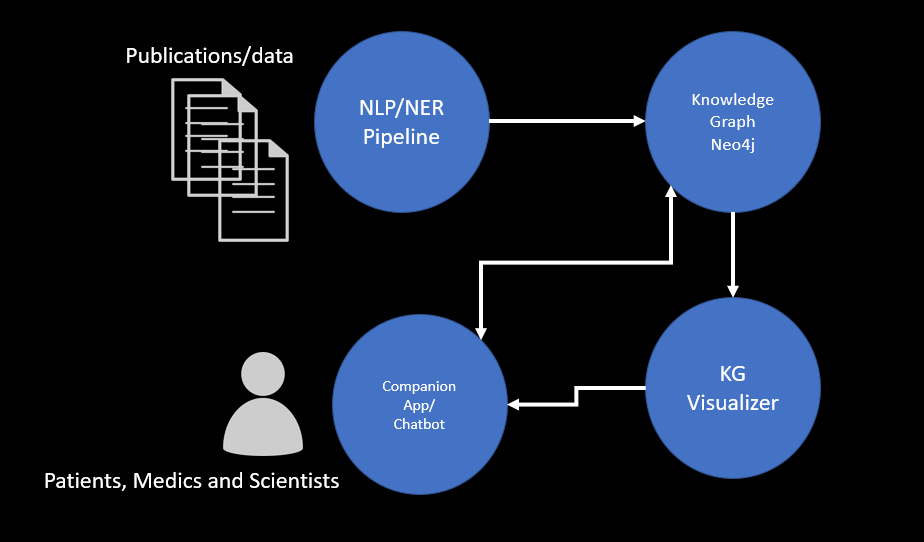

## Results 

### Semi-automatic process to collate information from datasets & publications 

 
The result shown below is based on the application of a Machine Learning technique called NER. 

NER, Named Entity Recognition, is an information extraction technique to locate and classify in predefined categories, such as people, organizations, places, time expressions and quantities, the named entities found in a text. 

The objective of implementing this technique is to facilitate the extraction of information about NF. This model will allow to automatically tag documents by extracting entities related to NF. For the hackathon, we have focused on NF1, but the process is the same for NF2 and schwannomatosis.  

This section details its implementation and how to use the model in a Google Colab Notebook. In addition, the results obtained are shown together with the external sources consulted, to obtain more information. 

 
#### Model Description 

First of all, before building and executing the model, it was necessary to create the training set. For this, the following pdfs on the NF1 disease have been downloaded. 

- [document 1: Quick and sustained clinical response to MEK inhibitor I in a NF1 patient](https://www.dropbox.com/s/p62kwidcaxi95tf/Quick%20and%20sustained%20clinical%20response%20to%20MEK%20inhibitor%20I%20in%20a%20NF1%20patient.pdf?dl=1) 

- [document 2: The NF1 gene in tumor syndromes and melanoma](https://www.dropbox.com/s/re1cp624nhqalk5/The%20NF1%20gene%20in%20tumor%20syndromes%20and%20melanoma.pdf?dl=1) 

- [document 3: Gastrointestinal Symptoms in Children and Adolescents with NF1](https://www.dropbox.com/s/0664u9481c51fh3/Gastrointestinal%20Symptoms%20in%20Children%20and%20Adolescents%20With%20Neurofibromatosis%20Type%201.pdf?dl=1) 

We have created a web-based application to tag the docs (NERDL). It helped us to test and validate the approach. 

Once downloaded, using the NERDL application, the tags for every document have been created. The selected entities have been Symptom, Disease, Pathway, Compound and Gene. These entities are present in the Knowledge Graph and will be described in next sections.  The rest of the words have been labelled with the label 0. The following image shows an example of how it works with a fragment of one of the commented pdfs. 

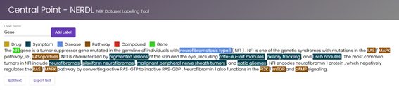

Once the text has been labelled, it is exported in a specific format: 

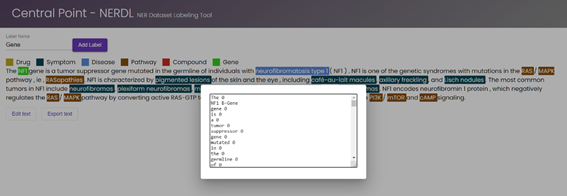

#### Results  

- Metrics for every label 

The results shown are promising. Even with only three documentsused to train the algorithm, we got  a precision of 62%  in a first iteration, with some classes reaching 79%. 

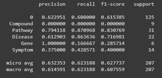

- Model prediction sample  

The following result has been inferred by the model. It is made up of three columns: WORD, Real Label, Predict Label. As said, we got very promising outputs, with a quite surprising precision -with some fails also,  but  promision since we trained with such a small set-. 

The 0 0 

NF1 B-Gene 0 

gene 0 0 

is 0 0 

a 0 0 

tumor 0 0 

suppressor 0 0 

gene 0 0 

mutated 0 0 

in 0 0 

the 0 0 

germline 0 0 

of 0 0 

individuals 0 0 

with 0 0 

neurofibromatosis B-Disease B-Disease 

type I-Disease I-Disease 

1 I-Disease I-Disease 

( 0 0 

NF1 0 0 

) 0 0 

. 0 0 

  

NF1 0 0 

is 0 0 

one 0 0 

of 0 0 

the 0 0 

genetic 0 0 

syndromes 0 0 

with 0 0 

mutations 0 0 

in 0 0 

the 0 0 

RAS B-Pathway B-Pathway 

/ 0 0 

MAPK B-Pathway B-Pathway 

pathway 0 0 

, 0 0 

ie 0 0 

, 0 0 

RASopathies B-Pathway B-Symptom 

. 0 0 

  

NF1 0 0 

is 0 0 

characterized 0 0 

by 0 0 

pigmented B-Symptom 0 

lesions I-Symptom 0 

of 0 0 

the 0 0 

skin 0 0 

and 0 0 

the 0 0 

eye 0 0 

, 0 0 

including 0 0 

café-au-lait B-Symptom B-Symptom 

macules I-Symptom 0 

, 0 0 

axillary B-Symptom B-Symptom 

freckling I-Symptom I-Symptom 

, 0 0 

and 0 0 

Lisch B-Symptom 0 

nodules I-Symptom 0 

. 0 0 

  

The 0 0 

most 0 0 

common 0 0 

tumors 0 0 

in 0 0 

NF1 0 0 

include 0 0 

neurofibromas B-Symptom B-Symptom 

, 0 0 

plexiform B-Symptom B-Symptom 

neurofibromas I-Symptom I-Symptom 

, 0 0 

malignant B-Symptom B-Symptom 

peripheral I-Symptom I-Symptom 

nerve I-Symptom I-Symptom 

sheath I-Symptom I-Symptom 

tumors I-Symptom I-Symptom 

, 0 0 

and 0 0 

optic B-Symptom 0 

gliomas I-Symptom B-Symptom 

. 0 0 

  

NF1 0 0 

encodes 0 0 

neurofibromin 0 0 

1 0 0 

protein 0 0 

which 0 0 

negatively 0 0 

regulates 0 0 

the 0 0 

RAS B-Pathway B-Pathway 

/ 0 0 

MAPK B-Pathway B-Pathway 

pathway 0 0 

by 0 0 

converting 0 0 

active 0 0 

RAS-GTP 0 0 

to 0 0 

inactive 0 0 

RAS-GDP 0 0 

. 0 0 

  

Neurofibromin 0 0 

1 0 0 

also 0 0 

functions 0 0 

in 0 0 

the 0 0 

PI3K B-Pathway B-Pathway 

/ 0 0 

mTOR B-Pathway B-Pathway 

and 0 0 

cAMP B-Pathway 0 

signaling 0 0 

. 0 0 

- REFERENCES 

Below as follow we present the main references that we’ve used for this chapter: 

[reference1] (https://www.kaggle.com/amrkeleg/fine-tuning-bert-models-for-bio-entity-recognition/notebook#Fine-tune-the-model) 

[reference 2] ( https://medium.com/analytics-vidhya/ner-tensorflow-2-2-0-9f10dcf5a0a) 

[reference 3] (https://medium.com/analytics-vidhya/fine-tuning-bert-for-ner-on-conll-2003-dataset-with-tf-2-2-0-2f242ca2ce06 ) 

[reference 4] (https://github.com/bhuvanakundumani/NER_tensorflow2.2.0.git) 

### Companion App  

The companion app has been created taking into account the input from patients and mentors. We had 1:1 meetings with mentors: practitioners, experts in pain and scientists and thanks to Salvatore La Rosa, a meeting with Spanish researchers. All of them gave us very valuable input. Kay Ashton MBE (Team Member) also got key info from NF community, through different questionaires.  

 

The companion app is allowin a patient to record and track the symptoms. The model has been designedto track also drug intakes, though for the hackathon we decided to focus on tracking symptoms: pain, mood and anxiety.  

 

The Companion App works as chatting with a human being. Patients can ask for information (either texting or talking –speechtotext-). It is quite accessible, cross-platform (smartphone, tablets, desktop pcs..)  and above all, it focused on engaging patients. We want them to have fun. That’s why created a smart mirror that was tested by Kay. There are many DIY tutorials to create a smart mirror.  

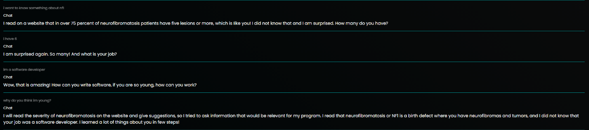

Kay Ashton MBE (team member, project manager and nf1 patient) used this [tutorial] (https://www.youtube.com/watch?v=NJlQqFDhti8) that is based on Rasberry Pi.  

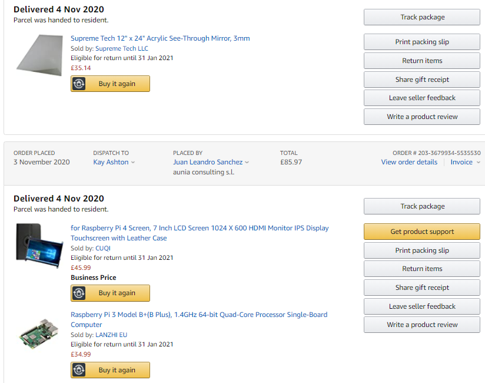

It is funny, engaging, cool and we believe it provides a perfect mix of fun, craftwork for the families and it ia a perfect basis for gamification. The relying concept is based on solid studies that could help to foster the involvement of comunity. A chatbot is something affordable, accesible, dynamic, you can even add personalities...  

### Knowledge Graph 

We had the clear will to contribute to community. We decided to look for projects that could be used as a starting point. An open project that could be enhanced. After analysing different options, we decided to work with [Hetionet](https://het.io/).  

“Hetionet is an integrative network of biomedical knowledge assembled from 29 different databases of genes, compounds, diseases, and more. The network combines over 50 years of biomedical information into a single resource, consisting of 47,031 nodes (11 types) and 2,250,197 relationships (24 types). 

Hetionet enables scientists and biologists to formulate novel hypotheses, predictions, and other valuable insights by connecting an existing body of biomedical data across multiple levels and types in a convenient, accessible, holistic way.” 

In this way, we are not only generating a starting pointfor NF, but also contributing to a very interesting project.  

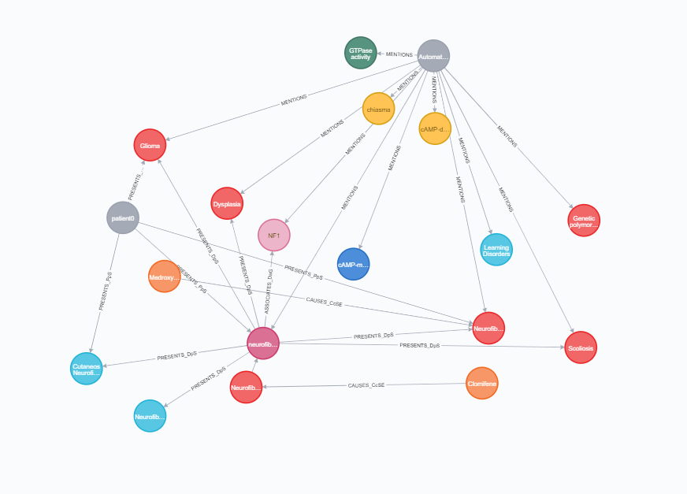

We’ve added new labels, relations and properties to cover the requirements of the hackathon. The possibilities are huge. We have created, among others,  the relation between compound and drug (not present in Hetionet). We also added the node :Publication, with curated data from PDFs available during the hackathon. Eventually, a crawler and the NER pipeline should allow to feed the Knowledge Graph. For the hackathon we decided to, besides the NER pipeline design, curate manually some docs. 

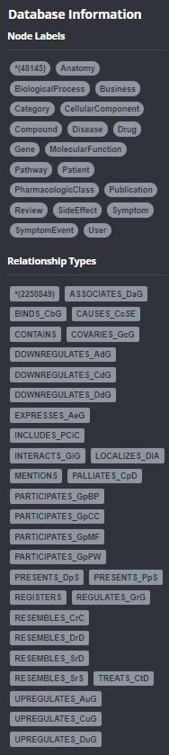
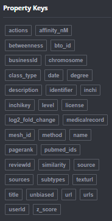

 For this, we used data from FDA: https://open.fda.gov/apis/downloads/ 

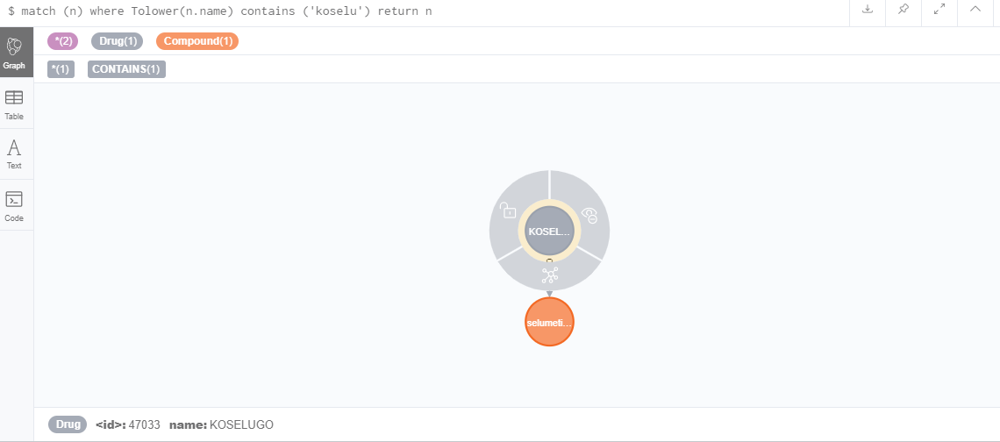

## Conclusion/Discussion: 

### What are the next steps? 

We all think that throughout all steps, the patient needs to remain the central point. With “central point” we are trying to help the NF community to go in this direction. To create a solid framework to go on this journey together, helping each other understand.  

We strongly believe that a crowd-source approach, supported by all the community will make the difference. We envision a “central point” growing; adding different languages, and squeezing the potential of Knowledge Graphs, NLP and Machine Learning.  

With this hackathon we have given the first steps: an engaging cross-platform companion app, a common place to break down silos, putting together patientes, practitioners and scientists...; We have learned a lot, and many new ideas are now in our minds after all the brainstorming and all the input we got.  Gamification, incentives, and a bunch of new insights are waiting! We want to make this grow.  

## Reproduction: How to reproduce the findings! 

 
### NERDL Application 

This web-based application can be accessed through your web browser by running the docker container, at localhost:3000 

We’ve just used it to support the training, but will be also publicly available, just in case it may be help someone in the future.  

### Semi-automatic process to collate information from datasets & publications 

To reproduce the process, we will need access to a jupyter notebook, training data and embeddings.  

#### First Step: Download training set and embeddings to train the model.  

[train] (https://www.dropbox.com/s/xhajo83akd3x2kz/train_NER_NF1.txt?dl=1) 

[embedding] (https://www.dropbox.com/s/ff36ifcn7ge6htn/glove.6B.100d.txt?dl=1) 

#### Second Step: Download the notebook from Google Colab. 

[notebook] (https://colab.research.google.com/drive/1MDCiJs0tI1UJ0g__sJkXogoUbgVXsAW8?usp=sharing) 

#### Step three:  

Upload the training set and embeddings to Google Colab environment. Simply click on the symbol, remarked in red in the figure below. Select the files that have been downloaded.  
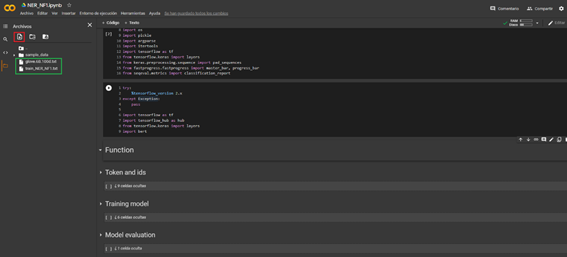

Once uploaded, the documents should appear as it is shown in the green rectangule in the previous image.  

#### Step four:  

The last step is running the code. Press ctrl+F9 or go to runtime menu on top and click run all option. 

### Knowledge Graph 

The Knowledge Graph has been implemented in Neo4j, and queries can be generated with [Cypher](https://neo4j.com/developer/cypher/). 

It is accessible through:  

http://15.236.64.163:7474/browser/ 

With user: neo4j and password: FrKnFXrvsWO3 

A simple query than can be executed is, for example: match (n) where Tolower(n.name) contains ('neurofi') return n; It will provide a view with the nodes and relations related to any entity witch name contains ‘neurofi’. 

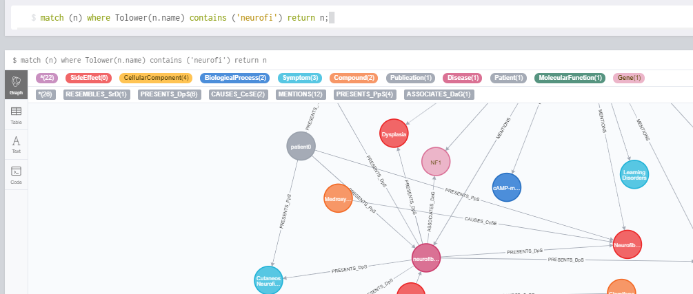

 

### Knowledge Graph Visualizer 

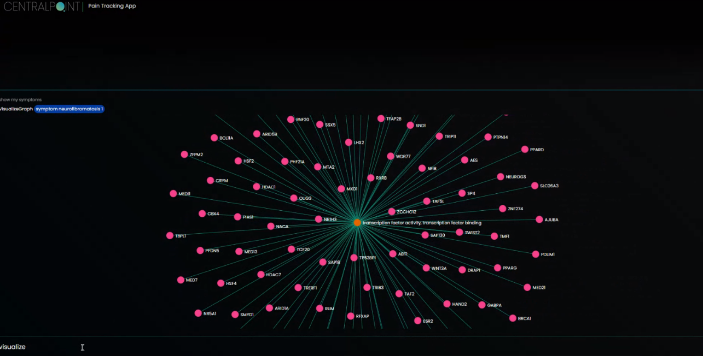

It can be accessed through the url: https://cpoint-pta-xvpevfpqeq-ew.a.run.app/

For the hackathon we have used the same interface for both features (companion and visualizer). 

A simple question to the chat bot to get a visualization can be:
- visualize neurofibromatosis 1
- visualize cafe au lait spots

### Companion App 

It can be accessed through the url: https://cpoint-pta-xvpevfpqeq-ew.a.run.app/  

Some questions that can be used to chat with the bot are:
- set pain level 10
- set anxiety level 10
- i found a cafe au lait spot on my arm
- show pain records from last week

It is usually kind and fun, and some good conversations may be established.  

### Docker 

PENDING 

Important Resources : primary data, github repository, Synapse project, dockerfile link etc. 

PENDING? 

# REFERENCES 

[1] VITA, Serena, et al. The'doctor apollo'chatbot: a digital health tool to improve engagement of people living with HIV. J Int AIDS Soc, 2018, vol. 21, no Suppl 8, p. e25187.  

[2] PERSKI, Olga, et al. Does the addition of a supportive chatbot promote user engagement with a smoking cessation app? An experimental study. Digital health, 2019, vol. 5, p. 2055207619880676.  

[3] DALEY, Kate, et al. Preliminary evaluation of the engagement and effectiveness of a mental health chatbot. Frontiers in digital health, 2020. 

[4] [Knowledge Graphs and Machine Learning] (https://towardsdatascience.com/knowledge-graphs-and-machine-learning-3939b504c7bc) 

[5] [What can a knowledge graph do for oncology?] (https://www.linkedin.com/pulse/what-can-knowledge-graph-do-oncology-helena-deus/) 

[6] [How to Use a Knowledge Graph for Precision Medicine] (https://blog.grakn.ai/precision-medicine-knowledge-graph-eea957d60c08) 

